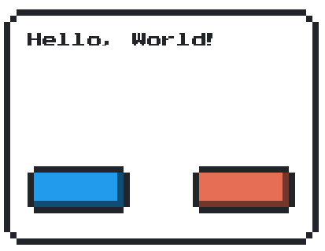

# NEStley

NES-style UI library for crixel inspired by https://github.com/BcRikko/NES.css

## Installation

1. Add the dependency to your `shard.yml`:
```yaml
dependencies:
  NEStley:
    github: fliegermarzipan/nestley
```
2. Run `shards install`

## Current Status



## Usage

```crystal
require "NEStley"
require "crixel"
require "fontanyl"

width = 400_u32
height = 300_u32

img = Crixel::SixelImage.new(width, height)
font = Fontanyl::BDF.new("font.bdf")

entities = [] of NEStley::Entity

# Create a container for our elements (optional)
cont = NEStley::BorderedOpaqueContainer.new(400_u32, 300_u32, 0, 0, NEStley::Color::LIGHT.value, NEStley::Color::DARK.value)
entities << cont

# Add a button or two
cont << NEStley::Button.new(130_u32, 60_u32, 30, 200, NEStley::Color::SUCCESS.value)
cont << NEStley::Button.new(130_u32, 60_u32, 240, 200, NEStley::Color::ERROR.value)

# Add some text
cont << NEStley::Textbox.new(340_u32, 150_u32, 30, 30, NEStley::Color::DARK.value)
  .set_font(font).set_msg("Hello, World!")

height.times do |y|
  width.times do |x|
    drawn = false
    entities.reverse_each do |entity|
      if entity.needs_redraw? && entity.wants_coord?(x, y)
        img.set(x, y, entity.color_at(x, y))
        drawn = true
        break
      end
    end
    img.set(x, y, 0xffffff_u32) unless drawn
  end
end
entities.each do |entity|
  entity.drawn!
end

img.render_naive_full
```

## Development

TODO: Write development instructions here

## Contributing

1. Fork it (<https://github.com/fliegermarzipan/nestley/fork>)
2. Create your feature branch (`git checkout -b my-new-feature`)
3. Commit your changes (`git commit -am 'Add some feature'`)
4. Push to the branch (`git push origin my-new-feature`)
5. Create a new Pull Request

## Contributors

- [Robin Broda](https://github.com/coderobe) - creator and maintainer
